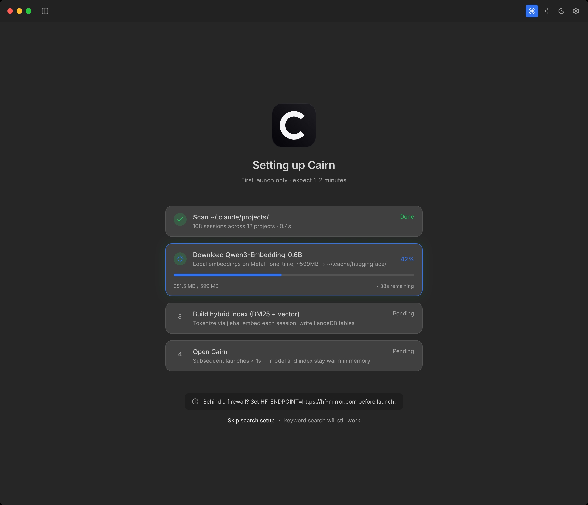
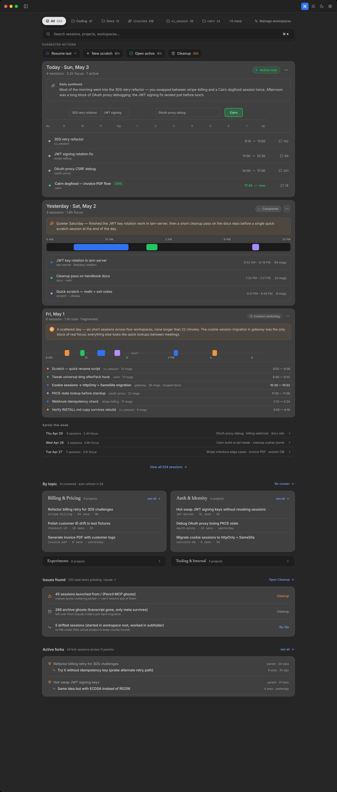

# Cairn — Claude Code Session Manager

A local-first session manager and hybrid search tool for [Claude Code](https://docs.claude.com/en/docs/agents-and-tools/claude-code/overview) on macOS.

Cairn reads `~/.claude/projects/` directly, never sends your transcripts off the machine, and gives you fast hybrid (BM25 + dense vector) search over every conversation you've ever had with Claude.

> Status: pre-1.0. Apple Silicon only. No Apple Developer signing — first launch needs a manual Gatekeeper bypass (see [Install](#install)).

## Screenshots



*First-launch setup. The Qwen3-Embedding-0.6B model downloads once into `~/.cache/huggingface/`, then the hybrid index builds in-process. Subsequent launches start in under a second.*



*Mix dashboard. Today + yesterday with AI daily synthesis, by-topic project clusters, and ⌘K hybrid search across every session you've ever had with Claude.*

---

## Why

Heavy users of `claude` end up with hundreds of session transcripts in `~/.claude/projects/<encoded-cwd>/<uuid>.jsonl`. The folders are hash-named, the files are unsorted, and there is no built-in way to find "that conversation last week where I debugged the migration."

Cairn solves three problems:

1. **Discovery.** Workspaces and projects are surfaced from real session activity, not directory tree noise.
2. **Search.** Every session is indexed (BM25 + Qwen3-Embedding-0.6B vectors), reranked with RRF (k=60), CJK-aware via jieba.
3. **Resume.** One click to relaunch a session in your terminal of choice (Terminal.app, iTerm2, Warp, Ghostty, kitty, Alacritty, or a custom command).

Everything is local. The vector store (LanceDB) lives in `~/.claude/cairn/lancedb/`. The embedding model weights download to `~/.cache/huggingface/` once, then run on-device via Metal (candle backend).

---

## Hardware requirements

**Apple Silicon Mac required.** M1, M2, M3, M4, or newer.

- The embedding model (Qwen3-Embedding-0.6B, ~600M params) runs on the Metal backend via [candle](https://github.com/huggingface/candle). On M-series silicon, warm queries land in ~100ms.
- On Intel Macs without Metal, the model falls back to CPU. **Don't.** A single embed takes 5–15 seconds on Intel, making hybrid search effectively unusable.
- Tested on macOS 12 (Monterey) and newer. `minimumSystemVersion` in the build is set to 12.0.0.
- LanceDB ships only an `aarch64-apple-darwin` prebuilt binary on macOS. There is no Intel Mac path without recompiling from source.

If you're on Intel: stick with [Cairn v0.1.0-universal.dmg](https://github.com/<org>/cairn/releases/tag/v0.1.0) which runs without the search subsystem, or wait for an Intel build.

---

## Install

### From the prebuilt DMG

1. Download `Cairn-0.1.0-arm64.dmg` from the [latest release](https://github.com/<org>/cairn/releases).
2. Open the DMG and drag **Cairn** to **Applications**.
3. First launch — choose one of:
   - **Right-click** the app → **Open** → confirm in the dialog.
   - **System Settings → Privacy & Security**, scroll to "Cairn was blocked", click **Open Anyway**.
   - Or just clear the quarantine flag in Terminal: `xattr -dr com.apple.quarantine /Applications/Cairn.app`.

The DMG is ad-hoc signed (no Apple Developer ID). Gatekeeper warns the first time only.

### From source

```bash
# Prerequisites:
#   - Apple Silicon Mac
#   - Bun ≥ 1.3 (https://bun.sh)
#   - Rust toolchain (https://rustup.rs)
#   - Xcode Command Line Tools

git clone https://github.com/<org>/cairn
cd cairn

bun install
bun run build:native      # builds the Rust embedder (~2–3 min first time)
bun run dev               # vite + electron, hot reload

# Or build a distributable DMG:
bun run package:mac       # outputs release/Cairn-0.1.0-arm64.dmg
```

If the embedder build is slow, edit `native-embed/Cargo.toml` to drop the `lto = true` and `codegen-units = 1` from `[profile.release]` — that gets development iteration down to seconds.

---

## What Cairn shows you

### Home dashboard

- **Mix view**: a unified ranked list of recent sessions across every workspace, with workspace/project pills as scope filters.
- **Workspaces sidebar**: register top-level folders (e.g. `~/Code`, `~/Notes`); Cairn auto-discovers projects inside them by reading actual session activity.
- **Search**: type into the top bar — hybrid BM25 + vector with RRF fusion, snippet highlighting, jieba CJK tokenization. Sessions, projects, and workspaces all rank in the same dropdown.

### Session detail (right drawer)

- AI-named title (one local `claude` call), original first user prompt, model, branch, file count.
- Inline chat preview of the first ~10 messages.
- Sticky bottom bar: copy session id, fork, resume in your terminal.

### Cleanup

Cairn tells you about:
- **Pollution** — sessions whose cwd is `/`, `~`, or otherwise outside any registered workspace (often Pencil MCP or test runs).
- **Drifted sessions** — launched from one folder but whose dominant cwd is somewhere else.
- **Dead links** — sessions whose project folder no longer exists on disk.
- **Archive ghosts** — sessions where the transcript is gone but metadata remains.

Each comes with a one-click action (cleanup / re-file / dismiss).

---

## Architecture

```
┌─────────────────────────────────────────────────────────────┐
│ Renderer (React 18 + Vite)                                  │
│   src/screens/WorkspacesHome.tsx     home + search          │
│   src/screens/SessionDetailView.tsx  right drawer           │
│   src/screens/AllSessionsView.tsx    all sessions browser   │
│   src/lib/search.ts                  lexical + vector merge │
└──────────────────────────┬──────────────────────────────────┘
                           │ window.cairn (contextBridge)
                           ▼
┌─────────────────────────────────────────────────────────────┐
│ Electron main (Bun-built, tsc → dist-electron/)             │
│   electron/ipc/workspace.ts   project + session discovery   │
│   electron/ipc/lancedb.ts     hybrid search / index rebuild │
│   electron/ipc/claude.ts      spawn local `claude` CLI      │
│   electron/ipc/terminal.ts    resume in iTerm2/Warp/etc.    │
│   electron/lib/sessionParser.ts  jsonl parser               │
└──────────────────────────┬──────────────────────────────────┘
                           │ NAPI in-process
        ┌──────────────────┴──────────────────┐
        ▼                                     ▼
┌──────────────────────────┐  ┌──────────────────────────────┐
│ @lancedb/lancedb         │  │ native-embed/                │
│ (Rust core)              │  │ (Rust crate via napi-rs)     │
│   - BM25 (Tantivy)       │  │   - fastembed-rs             │
│   - dense vector index   │  │   - candle (Metal)           │
│   - RRF reranker         │  │   - jieba-rs (CJK tokens)    │
│ ~/.claude/cairn/lancedb/ │  │ Qwen/Qwen3-Embedding-0.6B    │
└──────────────────────────┘  └──────────────────────────────┘
```

### Hybrid search pipeline

**Index time** (`lancedb:rebuild`, runs at most daily, incremental via djb2 content hash):

```
session.jsonl  ──parser──►  text (~1500 chars: title + first prompts + content)
                                   │
                                   ▼
                            ┌──────────────┐
                            │ jieba.cut    │  →  textIndexed (BM25)
                            │ _for_search  │
                            └──────────────┘
                                   │
                                   ▼
                            ┌──────────────┐
                            │ Qwen3 0.6B   │  →  vector[1024]  (FAISS-style)
                            │ (Metal)      │
                            └──────────────┘
                                   │
                                   ▼
                  ┌─────────────────────────────────┐
                  │ LanceDB table sessions          │
                  │  sessionId · text · textIndexed │
                  │  vector · projectPath ·         │
                  │  lastActive                     │
                  └─────────────────────────────────┘
```

**Query time** (`lancedb:search`, ~150ms warm):

```
query string
   │
   ├─►  jieba.cut_for_search  ─►  tokens  ──┐
   │                                         ▼
   │                              fullTextSearch (Tantivy BM25)
   │                                         │
   └─►  Qwen3 0.6B (Metal)  ─►  vec[1024] ──┤
                                  │          │
                                  ▼          ▼
                              VectorQuery + FTS  ──►  RRF (k=60)  ──►  topK
```

CJK queries that would otherwise miss (`产品设计` → tokens `产品 / 设计 / 产品设计`) hit any document containing either component.

### Data sources

- `~/.claude/projects/<encoded-cwd>/<uuid>.jsonl` — primary session transcripts (Claude Code writes these).
- `~/.claude/usage-data/session-meta/` — usage metadata for archive ghosts (sessions with no transcript).
- `~/.claude/cairn/lancedb/` — search index, owned by Cairn.

The encoding for `<encoded-cwd>` is `[/_\s] → -` (slash, underscore, and whitespace all collapse to `-`). The parser handles both `<wsName>_underscore` and `<ws name>_with_space` correctly. See `electron/lib/sessionParser.ts` for the full state machine.

---

## Privacy

- No network calls except the one-time embedding model download from Hugging Face. Set `HF_ENDPOINT=https://hf-mirror.com` to use the Chinese mirror.
- No telemetry. No analytics. No crash reporter.
- All AI features (rename suggestions, clustering) call your local `claude` CLI binary — no API key, no Anthropic API access from Cairn itself.
- The vector store and embedding model live entirely in your home directory.

---

## Tech stack

| Layer | Choice |
|---|---|
| Shell | Electron 33 (universal app, signed ad-hoc) |
| Build | Bun 1.3, electron-builder, vite 5 |
| Frontend | React 18, TypeScript 5, Tailwind CSS |
| Search core | LanceDB 0.27 (Rust, Tantivy BM25 + dense vector + RRF) |
| Embedder | fastembed-rs (Rust) on candle's Metal backend, Qwen3-Embedding-0.6B |
| CJK tokenizer | jieba-rs 0.7 (`cut_for_search` mode) |
| AI rename / cluster | Local `claude` CLI invocation |
| Storage | electron-store for prefs, raw filesystem for sessions, LanceDB for vectors |

The two NAPI native modules (`@lancedb/lancedb`, `native-embed/`) link directly into the Electron main process — no Python, no daemon, no subprocess.

---

## Development

```bash
bun install
bun run build:native      # build Rust embedder (only when native-embed/src changes)
bun run dev               # start vite + electron (hot reload for renderer)
bun test                  # 76 tests across parser / escape / promptBuilder
bun run typecheck         # tsc --noEmit on both tsconfigs
```

Common gotchas:

- **Native module rebuild.** Editing `native-embed/src/lib.rs` requires `bun run build:native`. The `.node` artifact lands in `native-embed/cairn-embed.darwin-arm64.node` and is loaded via `native-embed/loader.cjs`.
- **Stale electron main.** `dev:electron` recompiles `electron/*.ts` to `dist-electron/*.js` once at boot. If you edit main-process code, restart electron — vite-side hot reload only covers the renderer.
- **Port 1420.** Vite uses 1420; if it's already taken, kill the prior process: `lsof -ti:1420 | xargs kill -9`.
- **Index rebuild.** First launch with sessions will block on the embedder for ~1–2 minutes per ~100 sessions. Subsequent rebuilds are incremental via content hash and skip unchanged sessions.

---

## Contributing

Issues and PRs welcome. Before submitting:

1. `bun test` — all 76 tests must pass.
2. `bun run typecheck` — both tsconfigs must be clean.
3. If you touch `native-embed/`, run `cargo fmt` and `cargo clippy --release`.

The session parser (`electron/lib/sessionParser.ts`) is the highest-risk module — it ingests user data and any regression risks data loss. New parser features must include a fixture test against real `.jsonl` shapes.

---

## License

MIT — see [LICENSE](./LICENSE).

The embedding model (`Qwen/Qwen3-Embedding-0.6B`) is licensed separately under Apache 2.0 by Alibaba. LanceDB is Apache 2.0. fastembed-rs is Apache 2.0. jieba-rs is MIT.
